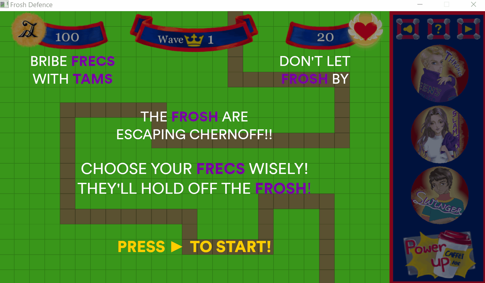

# Frosh Defence 

This is a game written completely in C++ that uses the Simple and Fast Multimedia Library (SFML). It was created by Chris Lai (manager), Connor Corwe, Echo Gao, Ryan Kinsella, Arman Dhillon, and Ayrton Foster for the final project of CISC 320 - Fundamentals of Software Development. 

[Download link for Windows machines](https://github.com/errantLai/frosh_defence/releases/download/1.0/Frosh.Defence.zip)

The game is meant to emulate an activity held during orientation/Frosh week, where first year students try to escape [Chernoff Hall](https://www.queensu.ca/encyclopedia/c/chernoff-hall). The game opens with some context, then leaves you to strategically bribe frecs with tams. Menu elements are hoverable, and provide information on a frec's cost, attack, and cooldown. Upgrading a frec improves all these elements, as well as expanding its attack radius. When the game starts, three different types of frosh run down the path, with various health, speed, tam drops, and damage as they reach the end. 

The game prevents you from placing frecs on top of one another, as well as along the path. Allowing too many frosh past ends the game. 

Tools used: 
- Atlassian suite of tools for project management and allocation. Jira for tasks, Confluence for notes, SourceTree as a git GUI
- [Simple and Fast Multimedia Library](https://www.sfml-dev.org/) for audio, sprites, and mouse input
- C++11, taking advantage of type inference with `auto`, shared_ptrs, and override identifiers. 

Music used: [KC and the Sunshine Band - Give It Up (8-Bit)](https://www.youtube.com/watch?v=Qk1x04GVnFc) by [DamageBar](https://www.youtube.com/channel/UCK3kXwR-ved2tCvGnyKX7vQ)

All art drawn by Echo Gao

Some interesting pieces of this project include:
- Use of the [game loop sequencing pattern](http://gameprogrammingpatterns.com/game-loop.html), to cleanly separate processing input, updates, and window renders. 
- Use of weak pointers when handling projectile collision. Projectiles holds a weak_ptr to a Frosh pointer, and deletes itself when the original shared_ptr to a Frosh is deleted (when Frosh runs out of health). 
- Animation effects by manipulating texture views within a spritesheet. 
